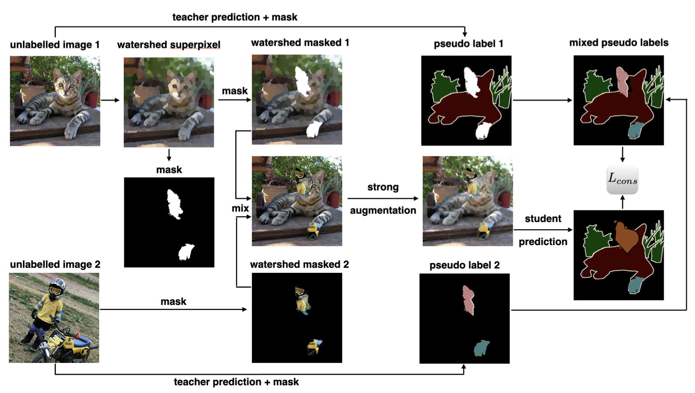
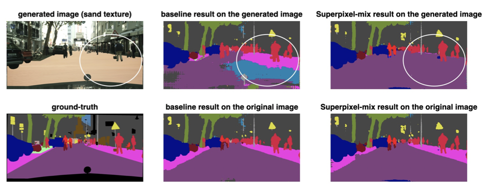
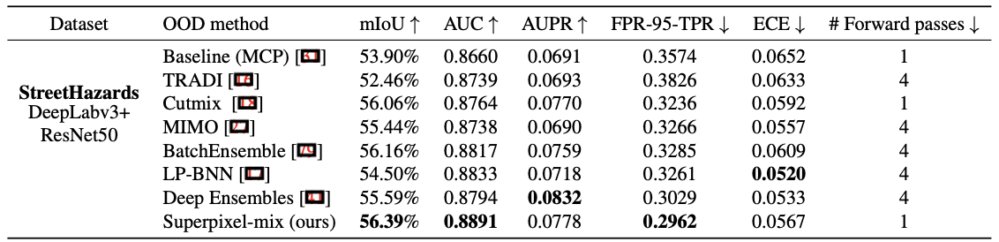
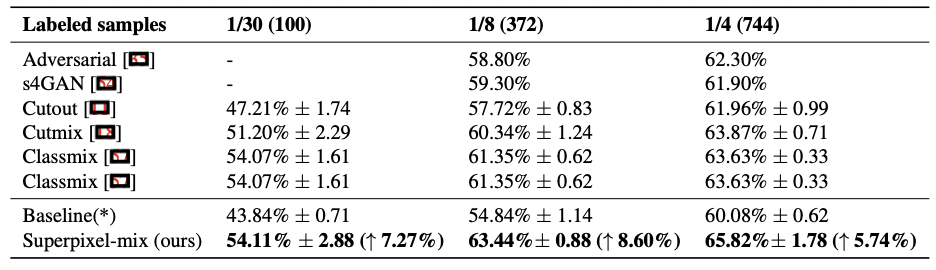
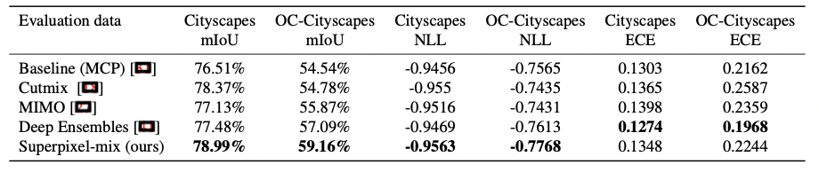
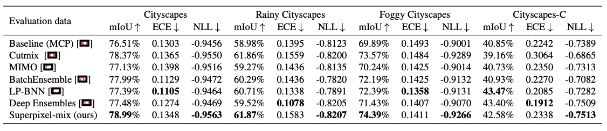

## 
 Robust Semantic Segmentation with Superpixel-Mix

 Robust Semantic Segmentation with Superpixel-Mix 

Gianni Franchi1, Nacim Belkhir2, Mai Lan Ha3, Yufei Hu1, Andrei Bursuc4, Volker Blanz3, Angela Yao5

1 U2IS ENSTA Paris Institut Polytechnique de Paris

2 Safrantech, Safran Group

3 Department of Computer Science University of Siegen

4 valeo.ai

5 School of Computing National University of Singapore

 BMVC2021 

&nbsp; &nbsp; &nbsp; &nbsp; &nbsp; &nbsp; &nbsp; &nbsp; &nbsp; &nbsp; &nbsp; &nbsp; &nbsp; &nbsp; &nbsp; &nbsp; &nbsp; &nbsp; &nbsp; &nbsp; &nbsp; &nbsp; &nbsp; &nbsp; &nbsp; &nbsp; &nbsp; [Paper](https://www.bmvc2021-virtualconference.com/assets/papers/0509.pdf) &nbsp; &nbsp; &nbsp; &nbsp; [Code]( https://github.com/giannifranchi/deeplabv3-superpixelmix)&nbsp; &nbsp; &nbsp; &nbsp;[Dataset](https://drive.google.com/file/d/1pKdlglcvsGseLzS1MX8SdjzQO2o1KZm6/view?usp=sharing)

### Abstract
Along with predictive performance and runtime speed, robustness is a key require- ment for real-world semantic segmentation. Robustness encompasses accuracy, pre- dictive uncertainty, stability under data perturbation and distribution shift, and reduced bias. To improve robustness, we introduce Superpixel-mix, a new superpixel-based data augmentation method with teacher-student consistency training. Unlike other mixing- based augmentation techniques, mixing superpixels between images is aware of object boundaries, while yielding consistent gains in segmentation accuracy. Our proposed technique achieves state-of-the-art results in semi-supervised semantic segmentation on the Cityscapes dataset. Moreover, Superpixel-mix improves the robustness of semantic segmentation by reducing network uncertainty and bias, as confirmed by competitive results under strong distributions shift (adverse weather, image corruptions) and when facing out-of-distribution data.

### Superpixel-mix

### OOD detection

### Semi-supervised learning

### Uncertainty experiments

